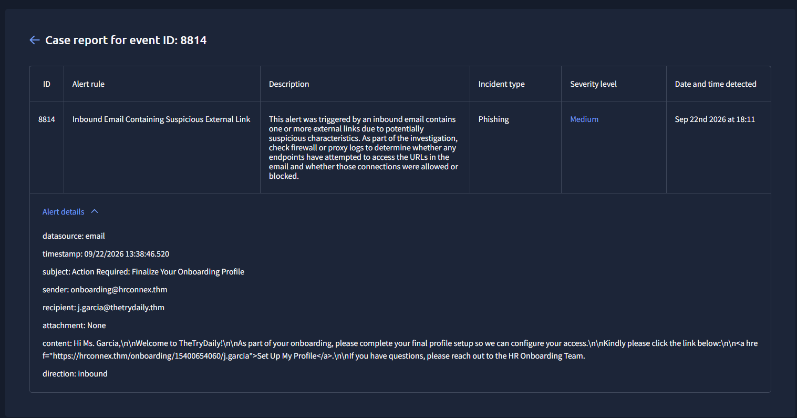
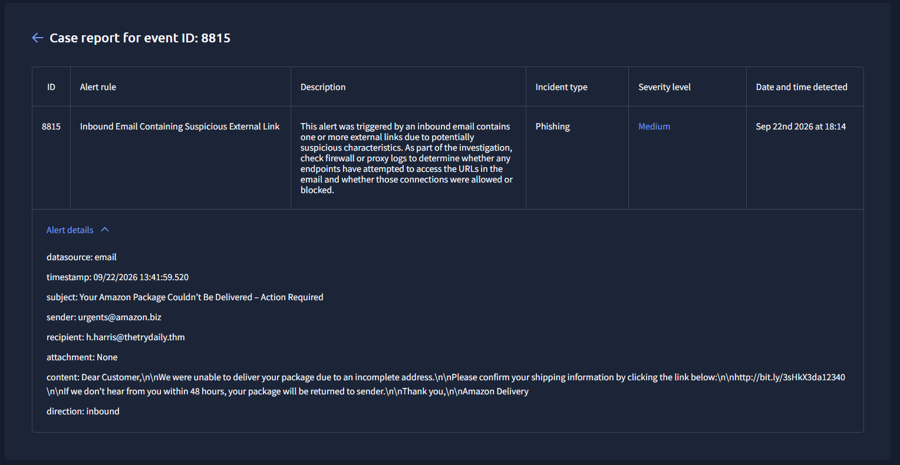
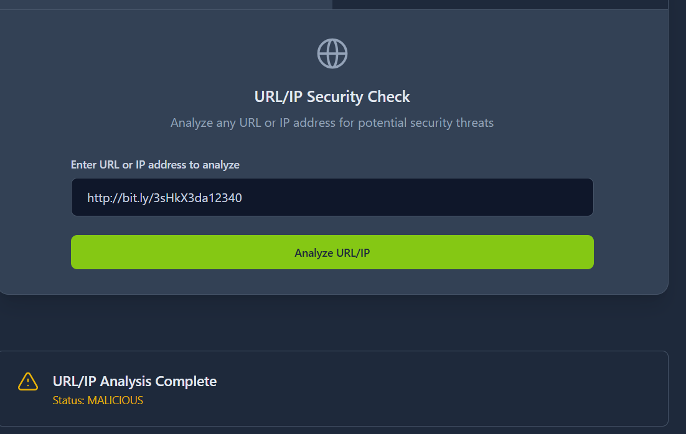

# SOC Case Report — Introduction to Phishing (TryHackMe SOC Simulator)

## 1. Case Overview

| Field | Details |
| --- | --- |
| Analyst | Altaf Khan |
| Date | 22/09/2026 |
| Scenario | Introduction to Phishing (SOC Simulator) |
| Alerts Reviewed | 4 |
| Verdict | 3 True Positives, 1 False Positive |
| Severity Breakdown | 2 Medium, 1 High, 1 Medium (FP) |
| Tools Used | Email review, URL/IP Security Checker, Firewall logs,Splunk |

### Summary

I reviewed 4 phishing-related alerts in this SOC Simulator scenario. Out of the 4, I marked 3 as true positives and 1 as a false positive. The alerts included a normal HR email that just looked suspicious at first, a fake Amazon delivery email with a malicious link, a firewall log showing someone clicked that same link, and a fake Microsoft security alert using a lookalike domain.

---

## 2. Methodology

Here's roughly how I went through each alert:

- Checked if the sender's domain actually matched who they claimed to be, and looked for small changes or typos in the domain (typosquatting)
- Looked at any links in the email — if it was a shortened link, I ran it through a URL/IP checker to see if it came back malicious or clean
- Read the email content for pressure tactics like "act now" or "your account is at risk," since that's usually a sign of phishing
- Checked firewall logs to see if anyone actually clicked a bad link, instead of just judging the email on its own
- Decided severity and whether to escalate based on whether the link was confirmed malicious and whether a user actually interacted with it

---

## 3. Alert Investigations

### Alert 1 — Inbound Email Containing Suspicious External Link (HR Onboarding)

| Field | Details |
| --- | --- |
| Time of Activity | 09/22/2026 13:38:46.520 |
| Sender | onboarding@hrconnex.thm |
| Recipient | j.garcia@thetrydaily.thm |
| Verdict | False Positive |
| Severity | Medium |
| Escalated? | No |

**What I checked:**
Sender domain, where the link actually pointed to, the tone of the email, and whether there was an attachment.

**Why I closed it as a false positive:**
This email said it was from HR asking the person to finish setting up their profile. The link in the email pointed to `hrconnex.thm`, which is the same domain as the sender — so there's no mismatch, no weird spelling, nothing pointing to a fake site. No attachment either. It just looks like a normal onboarding email that got flagged because it had an external link. I didn't find anything that actually indicated it was malicious.

**What I recommended:**
No action needed, closed the alert.

**Evidence:**`

---

### Alert 2 — Inbound Email Containing Suspicious External Link (Amazon Delivery Phishing)

| Field | Details |
| --- | --- |
| Time of Activity | 09/22/2026 13:41:59.520 |
| Sender | urgents@amazon.biz |
| Recipient | h.harris@thetrydaily.thm |
| Verdict | True Positive |
| Severity | Medium |
| Escalated? | Yes |

**What I checked:**
Sender domain, the shortened link (ran it through a URL/IP checker), and the wording of the email.

**Why I flagged it as a true positive:**
This one pretends to be an Amazon delivery notice, saying the package couldn't be delivered and giving a 48-hour deadline to fix it — classic urgency trick to get someone to click without thinking. Two things stood out right away: the sender's domain is `amazon.biz`, which isn't a real Amazon domain, and the link in the email was shortened (`bit.ly/3sHkX3da12340`) so you can't tell where it actually goes just by looking at it. I ran that link through the URL/IP checker and it came back as **malicious**. Between the fake domain, the hidden link, and the confirmed bad result, this was an easy true positive, and I escalated it.

**What I recommended:**
Block the sender domain and the malicious link/IP at the email gateway and firewall, and let the recipient know not to click anything from that email.

**Evidence:****Evidence:**

---

### Alert 3 — Access to Blacklisted External URL Blocked by Firewall

| Field | Details |
| --- | --- |
| Time of Activity | 09/22/2026 13:43:13.520 |
| Source IP | 10.20.2.17 (Port 34257) |
| Destination IP | 67.199.248.11 (Port 80) |
| URL | http://bit.ly/3sHkX3da12340 |
| Verdict | True Positive |
| Severity | High |
| Escalated? | Yes |

**What I checked:**
The firewall log entry, and compared the URL against the one I'd already flagged in Alert 2.

**Why I flagged it as a true positive:**
This alert showed a machine on the network (10.20.2.17) trying to reach `bit.ly/3sHkX3da12340` — the exact same link from the Amazon phishing email in Alert 2. So it looks like h.harris actually clicked the link from that email. The good news is the firewall blocked the connection before it reached the malicious destination. But the fact that someone clicked it in the first place is still a problem worth flagging, even though nothing got through. I connected this back to Alert 2 rather than treating it as a random blocked request, which is why I marked it high severity and escalated it.

**What I recommended:**
Keep the URL/IP blocked, check if any other devices tried the same connection, and follow up with h.harris about phishing awareness since they clicked the link.

**Evidence:**`<investigations/01-phishing-alert/alert3.png>`

---

### Alert 4 — Typosquatted Domain Impersonating Microsoft (Fake Security Alert)

| Field | Details |
| --- | --- |
| Time of Activity | 09/22/2026 13:44:17.520 |
| Sender | no-reply@m1crosoftsupport.co |
| Recipient | c.allen@thetrydaily.thm |
| Verdict | True Positive |
| Severity | Medium |
| Escalated? | Yes |

**What I checked:**
The sender's domain spelling, where the link in the email pointed to, and the wording used to create urgency.

**Why I flagged it as a true positive:**
This email claims there was an "unusual sign-in" to the recipient's Microsoft account from Lagos, Nigeria, and tells them to click a link to review it. The sender's domain is `m1crosoftsupport.co` — notice the "1" instead of an "i" in "microsoft." That's a typosquat, made to look like Microsoft at a quick glance. The "review activity" link in the email also goes to that same fake domain instead of an actual Microsoft site, which means this is really just trying to get the person to enter their real login details on a fake page. Fake urgency + lookalike domain + fake login page = textbook phishing, so I marked it true positive and escalated it.

**What I recommended:**
Block the sender domain/IP, add `m1crosoftsupport.co` to the blocklist, and tell the recipient not to click the link or enter their credentials if they already clicked it.

**Evidence:**`<investigations/01-phishing-alert/alert4.png>`

---

---

## Key Takeaways

A few things this exercise reminded me of:

- **Check the actual domain, not just the name.** Two of the three true positives (`amazon.biz` and `m1crosoftsupport.co`) relied on small domain tricks that are easy to miss if you're skimming instead of actually comparing the sender against the real domain.
- **Not every external link is bad.** Alert 1 looked similar to the phishing ones at first glance (external link, "action required" tone), but once I actually checked where the link went, it matched the sender's own domain. Good reminder not to jump to conclusions based on surface-level similarity.
- **Alerts connect to each other.** Alert 3 only made sense once I linked it back to the malicious URL from Alert 2 — it wasn't just a random blocked connection, it was proof that someone actually clicked the phishing link. Treating alerts as part of a timeline instead of one-off events gave a much clearer picture of what actually happened.
- **Don't just eyeball it — verify.** Running the suspicious link through a URL/IP checker gave me an actual confirmed answer instead of just a hunch, which made the call to escalate a lot more solid.

---

## 6. Disclaimer

This report is based on an investigation done inside TryHackMe's SOC Simulator, a training environment. All the domains and email addresses here (like anything ending in `.thm`) are fake and made for practice purposes — no real people or companies are involved.
